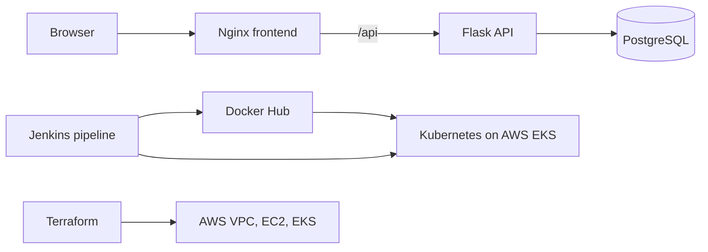

# Cloud-Native Task Manager – Complete DevOps Platform

A task management web application with a Flask API, a static Nginx frontend, and PostgreSQL. Docker Compose supports local use; Terraform provisions AWS infrastructure; Kubernetes deploys the application to EKS; Jenkins builds, tests, publishes, and deploys the images.

## Application and Architecture

The frontend serves the existing Task Manager pages and proxies API requests to Flask. PostgreSQL stores application data. The application is split across three runtime services: frontend, backend, and database.



The Kubernetes manifests are in `k8s/`; Terraform provisions the AWS network, EC2 host, EKS control plane, and worker nodes. PostgreSQL uses a persistent volume claim. The frontend Service is a load balancer; the Ingress manifest is available for clusters with an ingress controller configured for the `nginx` class.

## Local Run

Requirements: Docker Engine and Docker Compose v2.

1. Copy `.env.example` to `.env`.
2. Set `POSTGRES_PASSWORD` to a unique database password and `SECRET_KEY` to a generated random value. For example, generate a key with `python -c "import secrets; print(secrets.token_urlsafe(48))"`. Do not commit `.env`.
3. Start the services:

```sh
docker compose up --build
```

Open `http://localhost`. The backend health endpoint is `http://localhost:8888/api/health`.

Stop the services with `docker compose down`. The named PostgreSQL volume is retained; add `-v` only when you intentionally want to delete local database data.

## AWS and Kubernetes

Requirements: an AWS account with permissions to create the resources in `terraform/`, Terraform 1.5+, AWS CLI, and an SSH key pair. EKS, NAT gateways, load balancers, and EC2 incur charges.

1. In `terraform/`, copy `terraform.tfvars.example` to `terraform.tfvars` and set a region-valid AMI, a supported EKS version, and matching availability zones/CIDRs.
2. Create the public SSH key at `terraform/keys/<key-name>.pub`, matching `ec2_key_pair_name`. Keep the private key outside the repository.
3. Set `allowed_ssh_cidrs` to your public IP with a `/32` suffix only if SSH or the Jenkins UI is needed. The default allows neither.
4. Review and apply the infrastructure:

```sh
cd terraform
terraform init
terraform fmt -check
terraform validate
terraform plan
terraform apply
```

The Jenkins pipeline needs a Linux agent with Docker, Docker Compose v2, AWS CLI, `kubectl`, `curl`, and the Jenkins credentials bindings it uses. Configure these Jenkins credentials: `dockerhub-credentials` (Docker Hub username/password), `aws-credentials` (AWS credentials), `taskmanager-db-password` (secret text), and `taskmanager-app-secret-key` (secret text). Set the `DOCKERHUB_NAMESPACE`, `AWS_REGION`, and `EKS_CLUSTER_NAME` build parameters to your own values. The image repositories must be public or the cluster must be configured to pull from them.

The pipeline creates Kubernetes Secrets at deploy time from Jenkins credentials. No credential values belong in the repository. The cluster needs the AWS EBS CSI add-on for PostgreSQL storage; the pipeline waits for it before applying the claim. Install an ingress controller for the `nginx` class if you want to use `k8s/ingress.yaml`; the frontend load balancer works independently.

Destroy disposable AWS infrastructure with `terraform destroy` after reviewing its plan. Persistent volumes and other resources can incur charges until removed.

## CI/CD Flow

Jenkins checks out the repository, builds both Docker images, starts the local Compose application and checks its HTTP endpoints, pushes build-tagged images, applies the Kubernetes resources, and waits for PostgreSQL and application rollouts.

## Repository Guide

- `backend/`: Flask API and PostgreSQL integration
- `frontend/`: static Task Manager UI and Nginx configuration
- `docker-compose.yml`: local application stack
- `Jenkinsfile`: CI/CD pipeline
- `k8s/`: namespace, application/database workloads, storage, and ingress
- `terraform/`: AWS VPC, EC2, EKS, IAM, and security groups
- `jenkins/`: optional Kubernetes RBAC and deployment manifests for Jenkins
